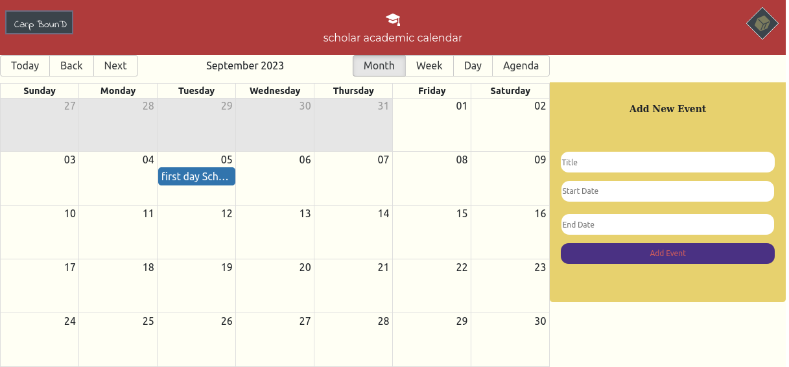
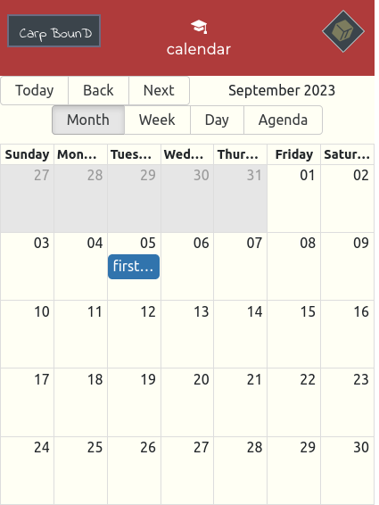

# calendar app

Sideland : **## scheduler and time events**

> ### Overview :

- When talking about time, we sometimes desire to also refer a place. Because time and space goes along.
- You might wish to travel today is all about time, but you will end up reaching somewhere , in a room or a city.
- Can we make a room for time and space? That is our need to unify these two in our calendar App. This concern will make time and space come together. It is a scheduler for your tasks and a reminder for your events. Don't waste your time.

## Interest

You might be interested on how:

- to learn about the npm package module`react-big-calendar` to quickly buld a calender.

- and also `react-datepicker` to handle times data in your app.

### Links

- Solution URL: [https://github.com/BeinRain06/calendar-app.git](https://github.com/BeinRain06/calendar-app.git)
- Live Site URL: [https://beinrain06.github.io/calendar-app/](https://beinrain06.github.io/calendar-app/)

## CSS Structures:

> two main components in your <App/>:
> -SearchBar.jsx, and MeaningsBox.jsx

**Picture**

---

---

# What I learned

### Use Bootstrap Classes in React

All we need to do is to install bootstrap and import **minified version** of css and js in the **indexjs** file of our project.
After that we can use and learn about classes of bootstrap in the source website : [https://getbootstrap.com](https://getbootstrap.com)
Like this:

- command(inside our directory project) : npm install bootstrap
- add :
  - import "bootstrap/dist/css/bootstrap.min.css";
  - import "bootstrap/dist/js/bootstrap.bundle.min";
- Use Classes you need searching over the bunch of classes given in the official website _getbootstrap.com_

### Achieve Calendar with react-big-calendar

- **react-big-calendar** is a npm package module that you can install in your react and use easily to build your calendar in your react project
- one thing important to make **<Calendar/>** component of react-big-calendar render is to well define a variable called **localizer**. All you need to know about ii is specified in the documentation.
- one Other thing is to not forget to link the **css** style that goes along into you main file where you build your **<Calendar/>** component
- You might need also to configure **<DatePicker>** component on the same way looking through the npm documentation or several examples given online to enable it to function.

### to carefully use `useState Hook` in parent and children components.

### utilities Materials:

    - bootstrap and bootstrap icons
    - react-big-calendar
    - react-datepicker
    - date-fns

### Mobile Responsiveness

    - Mobile reponsiveness for mobile min-width: 210px

## **Picture**

---

## Callback History:

- There have been many historical calendar after and before J.C . In he middle age the **gregorian calendar** replace the **julian calendar**. Both consist on twelve month based on a solar year, but with the gregorian more accurate than the julian. This calendar employed a cycle of year of 365.2425 days.
- Even today we have many calendar some conveying time in relation to the sun and others in relation to the moon. We still have example of **Chinese** and **Islamic Calendars** based on the motion of the moon around the earth, rather than the motion of the earth in relation to the sun, and **Jewish calendar** that to his way links years to cycle of the sun an months to the cycle of the moon
- Still other languages die out due to political oppression or social assimilaion, though many dying languages **live on** in the vocabularies and dialects of prominent languages around the world.

**_Roman Empire_**
In 45 **B.C** (before Christ), **Julius Caesar** ordered a calendar consisting of twelve months based on a solar year, best known as **Julian Calendar**

## Useful Resources :

- Arjun Khara[Youtube]: [https://www.youtube.com/watch?v=pgMIp4ghGr0](https://www.youtube.com/watch?v=pgMIp4ghGr0) : this resource help me built arrow on a middle top of a div Box with the brief and concise explanation given.

  >

- react-big-calendar[Community]: [https://github.com/jquense/react-big-calendar](https://github.com/jquense/react-big-calendar) : That made this app to live in few hours with their good design of calendar template.

## Acknowledge:

This project always remember the Team :

- **Sufa Digital**: udemy with his enlightment about the feature to achieve this project
  >
- react-big-calendar[Community] with their amawing calendar template that help me earn a lot of time to build my app.
  >
- Arjun Khara[Youtube] with his concise tutorial on how to build **arrow** layer on a box.

_Our Work always remember this team_

## Author

- Frontend Mentor - [https://www.frontendmentor.io/profile/BeinRain06](https://www.frontendmentor.io/profile/BeinRain06)
- Twitter - [https://twitter.com/nest_Ngoueni](https://twitter.com/nest_Ngoueni)
